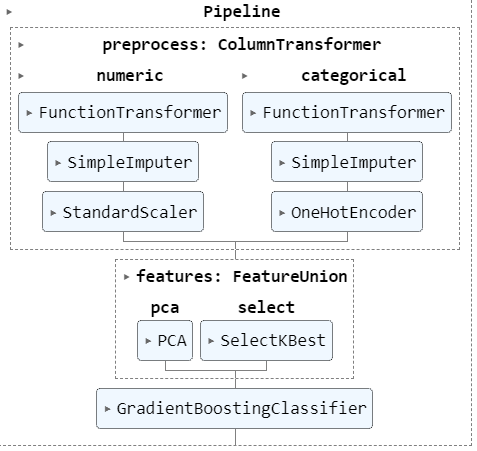
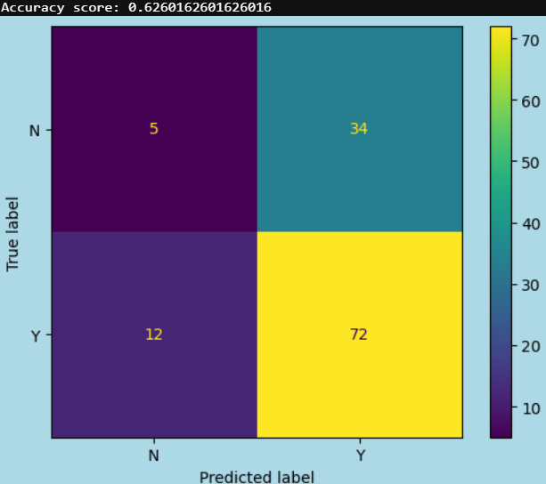
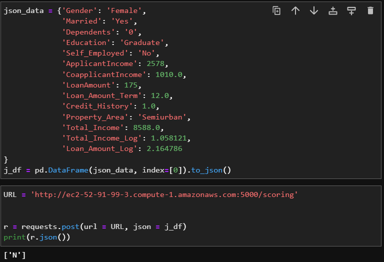

# Predicting Loan Qualifications

### [Assignment](assignment.md)

## Introduction
Borrowing money is a big part of world these days, lots of factors may apply to wether or not you get approved for that loan you need for that thing you need. In this project, I will take a data set of loan applicants and look for patterns within to tell us more about approval selection

## Hypothesis
### Applicants with higher applicant and co-applicant incomes are more likely to get a loan approved

I believe that banks are mostly concerned with your income/assets when it comes to handing you their money, and that certain categorical attributes or demographic are not a big factor in this decision.

## EDA 
(fill in what you discovered in your exploration of the dataset)

## Process
(fill in what you did during EDA, cleaning, feature engineering, modeling, deployment, testing)
We want to automate the loan eligibility process based on customer details that are provided as online application forms are being filled. 

### Step 1: EDA 

I explored the categorical and numerical data separately.
#### Categorical:
Lots of imbalance in the categorical data, May be due size of data set (about 700 rows)
Findings of note- 
Most popular loan term being 360 month term.
Applicants with a graduate did not necessarily have higher income
#### Numerical:
Outliers within income and loan amount
Resolved with log transformation

### Step 2: Build Preprocessing Pipeline
Final Preprocessing Pipeline

### Step 3: Model Building/Tuning
Before Grid Search:

With parameter tuning we were able to improve accuracy to: 0.63

## Results/Demo
AWS deployment test

## Challenges 
Hyper parameter tuning: trouble finding best parameters to improve models even with gridsearch, I believe due to lack of understanding of some of the parameters themselves.
Solution - Study/Review ML algorithms and params

Working with AWS: Technical difficulties learning the ropes of cloud services.
Solution - More cloud experience!

## Future Goals
- Manage task time better
- Understand parameters thoroughly
- Find ways to store incoming data and train model continuously?
